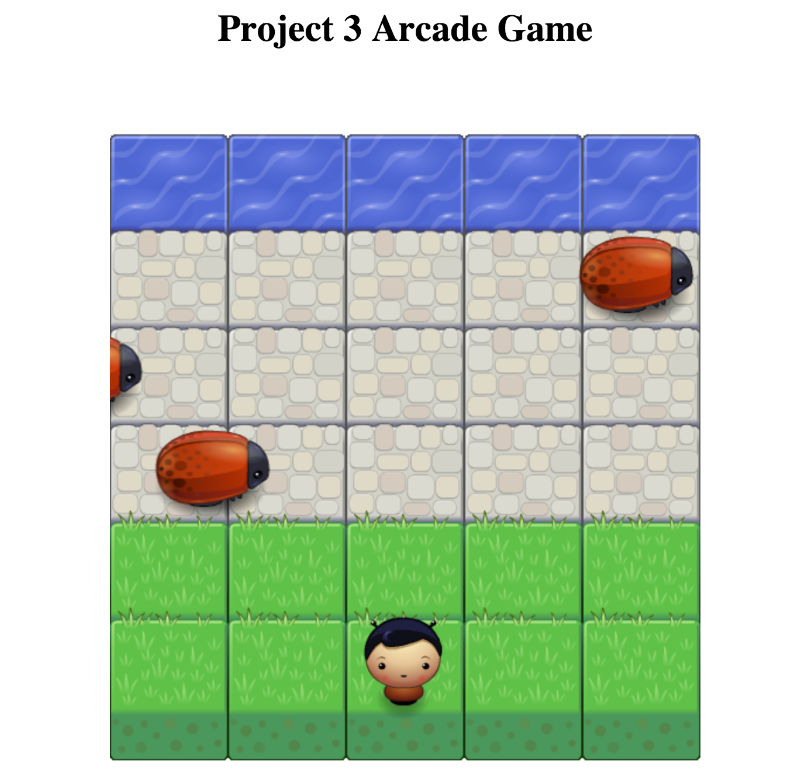

# Front-End Nanodegree Arcade Game

A simple browser based arcade game. Click [HERE](http://guanxiaomin.github.io/FEND-P3-arcade-game) to play. Enjoy!

## Overview
Arcade Game is build with JavaScript. In this game you have a Player and Enemies (Bugs). The goal of the player is to reach the water, without colliding into any one of the enemies. The player can move left, right, up and down. The enemies move in varying speeds on the paved block portion of the scene. Once a the player collides with an enemy, the game is reset and the player moves back to the start square. Once the player reaches the water the game is won.

## Controls

Use arrow keys to move player.

### Project Specification
[Frogger Game: Getting Started](https://docs.google.com/document/d/1v01aScPjSWCCWQLIpFqvg3-vXLH2e8_SZQKC8jNO0Dc/pub)